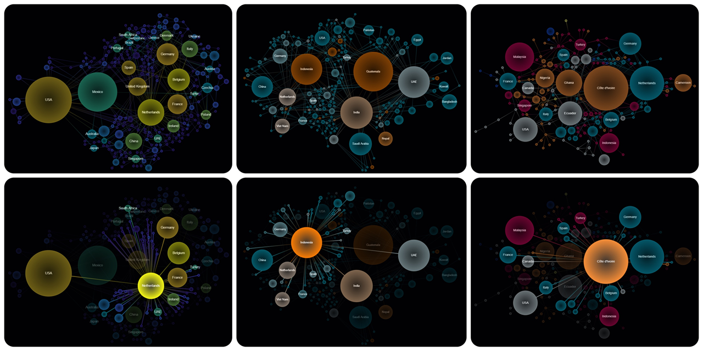
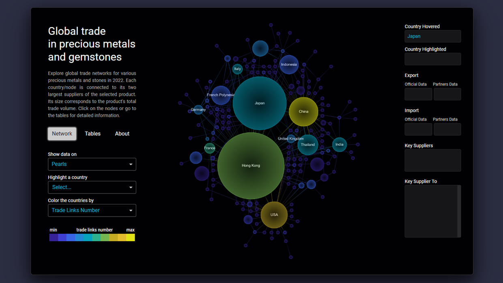

**This script creates an interactive graph of the international trade network for any product (or group of products) from the UN Comtrade database.** This allows you to quickly gain insight into how international trade is organized for a particular product, identify trade links that countries have not reported, and identify countries and territories that have closed trade reporting or do not report trade at all.

The created graph will be colored according to the option selected by the user; its nodes, when clicked, will display the name of the country and will be highlighted with all its trade connections. The network can be saved in *.png format.

# What does the graph represent?



The network graph will link each country/territory that traded the commodity of interest during the specified period to its leading (in US dollar) suppliers of the commodity. 

The <b>size</b> of the nodes is determined by the total trade volume of the product (imports + exports in US dollars). Nodes are <b>colored</b> according to the selected parameter: the regions they belong to, the number of their trade links, or the export-import balance of their trade. The <b>link</b> between two countries reflects the direction of net trade flow between them (the difference in mutual exports)

<b>You choose the coloring option, how many connections per country to display, and whether to highlight a specific country with all of its trading partners.</b>

The script itself is [here](global_trade_network.py). The process of creating a graph is described in detail in [this notebook](https://nbviewer.org/github/lomska/global_trade_one_minute_viz/blob/main/Building_a_Network_Graph_of_Global_Trade.ipynb).

## Usage examples

<a href="https://precious-trade-9495c0104c61.herokuapp.com/" target="_blank"></a>
[This project](https://precious-trade-9495c0104c61.herokuapp.com/) provides a quick snapshot of international trade networks in precious stones, metals, and their products, including trade links not included in official country reports and non-reporting trade areas (those that have closed reporting, as well as free trade areas and bunkers).

# Usage

## Get a free Comtrade subscription key

You need to create a Comtrade B2C account, add a **comtrade - v1** API to your subscriptions, and copy the generated code. Just follow the [instructions](https://unstats.un.org/wiki/display/comtrade/New+Comtrade+User+Guide#NewComtradeUserGuide-UNComtradeAPIManagement). 

## Install the packages

- [Comtradeapicall](https://pypi.org/project/comtradeapicall/)
- [PyGraphviz](https://pygraphviz.github.io/)
- [Plotly](https://plotly.com/python/)
- [Networkx](https://github.com/networkx/networkx)
- [DASH](https://plotly.com/dash/)
- [Dash Cytoscape](https://dash.plotly.com/cytoscape)
- [Dash Bootstrap Components](https://dash-bootstrap-components.opensource.faculty.ai/)

## Adapt the code to your needs

I mean, adapt [this file](global_trade_network.py).

### Insert your Comtrade subscpiption key:

subscription_key = "xxxxxxxxxxxxxxxxxxxxxxxxxxxxxxxxxx"

### API requests: specify product and time period

```
comtrade_exp = comtradeapicall.getFinalData(
    subscription_key,
    typeCode='C', 
    freqCode='A',              # time interval
    clCode='HS',
    period='2022',             # time period
    reporterCode=None,
    cmdCode='220870',          # product HS code
    flowCode='X',
    partnerCode=None,
    partner2Code='0',
    customsCode='C00',
    motCode='0',
    maxRecords=250000)
```

All available products can be found in [this file](comtrade_codes/harmonized-system.csv) ([its initial source](https://github.com/datasets/harmonized-system)). Paste the HS code of the product you are interested in into the **cmdСode** field of both API requests. If you're inserting a group of codes, paste it as one string, separated by commas: "010121,010122,010129".

Specify the time interval (**freqCode**) and a particular period (**period**). Time interval can be either Annual (freqCode=’A’) or Monthly (freqCode=’M’). Accordingly, period will be either a year (period=’2022’) / group of years (period=’2019,2020,2021’), or a month (period=’202206’) / group of months (period=’202201,202202,202203’).

For further code to work correctly, it is better not to change other request parameters except those indicated.

Each request is limited to 250 thousand records.

### Select Network Options

#### Number of trade links to display 

```
n_links = 2
```

The network connects each country/territory to its N largest (in US dollars) suppliers of a selected good. N_links determines how many links to draw. The optimal number is between 1 and 3; more links tend to look too cluttered in most cases.

#### Coloring parameter 

```
coloring_parameter = 'export_share'
```

Specify how you want the network nodes to be colored:

- **export_share**: balance between exports and imports of the selected product for each country (10/90%, 50/50%, 70/30%, etc.);
- **pagerank**: country ranking depending on the number of its trade links (similar to Google PageRank)
- **region**: the region where the country is located (Africa, Americas, Antarctica, Asia, Europe, Oceania, Special categories *)

\* A detailed explanation of special categories (free zones, bunkers, etc.) and unspecified zones can be found [here](https://unstats.un.org/wiki/display/comtrade/Areas+not+elsewhere+specified#:~:text=What%20is%20Special%20categories%20) 

#### Image width (pixels)

```
pic_width = 900
```

The proportion of width and height of a graph depends on its layout generated by PyGraphviz. After setting the width of the image, its height will be adjusted to maintain the proportions.

## Run code

### Save the created image in *.png format
To save the created image, сlick the corresponding button on the created page.
