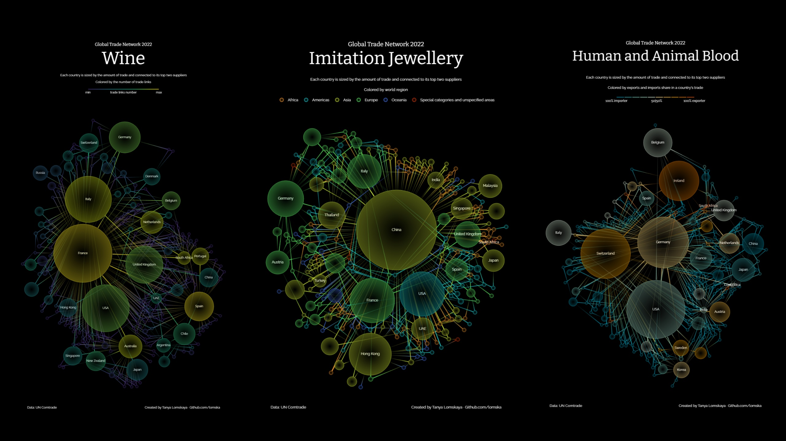
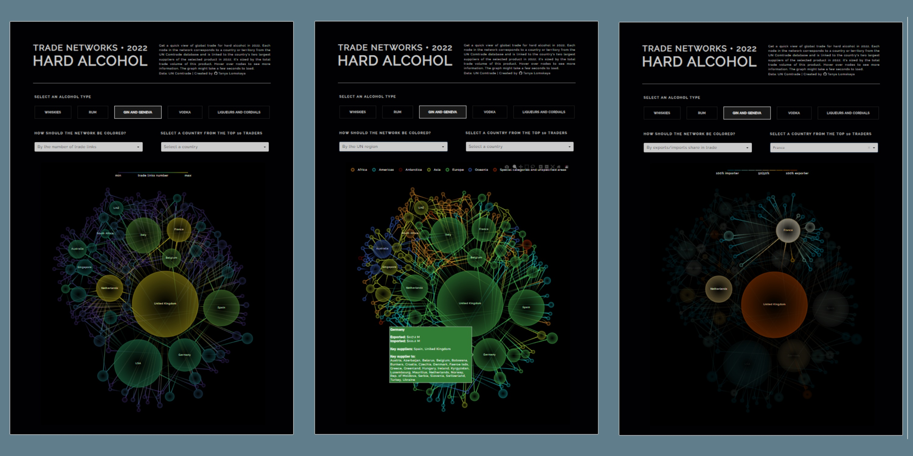
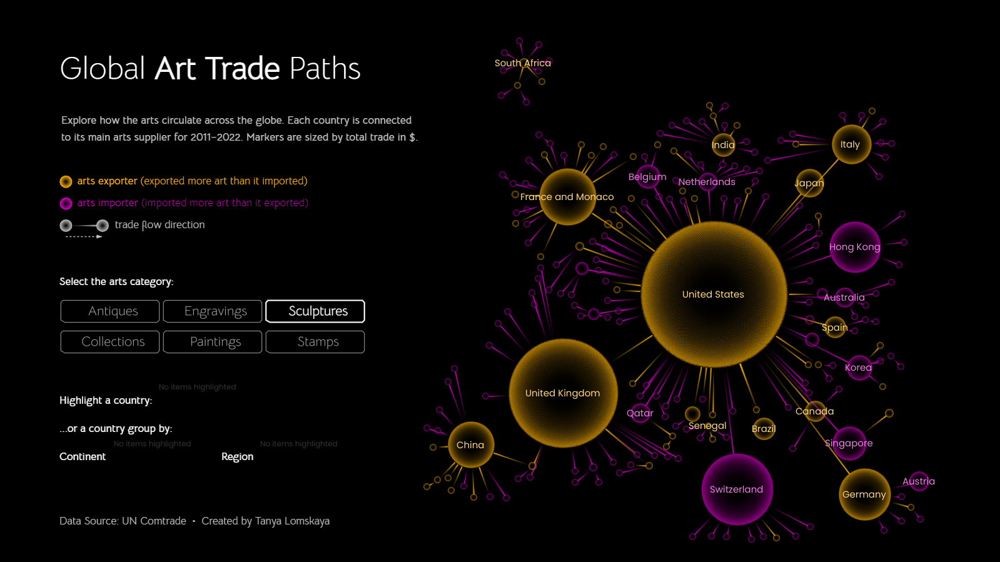

**What if you want to pick a product and quickly get an idea of how all international trade for that product is organized?** Using this code, you can build an international trading network for any product (or group of products) from the UN Comtrade database for the period of interest in an average of 40 seconds (however, this depends on the speed of the Comtrade API). The network graph will contain the following information:
- value of each country's exports and imports;
- key suppliers of each country and the countries for which it itself is a key supplier;
- the direction of trade flows.

# What is created?



The network graph will connect each country/territory that traded the commodity you are interested in during the specified period with its leading (in US dollars) suppliers of the commodity. **You decide how many connections per country to show**. 

The size of the nodes is determined by the total trade volume of the product (imports + exports in US dollars). **The nodes are colored according to a parameter of your choice**: regions to which they belong, the number of their trade links, or the export/import balance of their trade. Above you see three examples of coloring: the nodes of the wine network are colored depending on the number of trade connections (most of all in France and Spain); Jewelry network nodes are colored by region; Blood network nodes are colored based on their export/import balances (Ireland is almost 100% exporter and China is almost 100% importer). 

The tooltip for each node indicates its total value of exports, the total value of imports, the key suppliers of the product to the country, and the countries for which it itself is a key supplier.

The link between the two countries reflects the direction of the net trade flow between them (the difference in mutual exports). 

If you wish, **you can highlight one country with all its trading partners**. 

The process of creating a graph is described in maximum detail in [this notebook](https://nbviewer.org/github/lomska/global_trade_one_minute_viz/blob/main/Building_a_Network_Graph_of_Global_Trade.ipynb).

More examples of graphs like the ones above can be found in [this folder](demo_graphs/).

## Interactive examples

<a href="https://alcotradenets2022-d1f5de444d2b.herokuapp.com/" target="_blank"></a>
Here's a small [hard alcohol trading demo dashboard](https://alcotradenets2022-d1f5de444d2b.herokuapp.com/) that shows how chart interactivity works. Toggle settings to change the color of networks and highlight individual countries (one of the top 10 traders can be highlighted for each drink). It may take 4-5 seconds for the chart to load and update.
<br><br><br><br>

<a href="https://public.tableau.com/app/profile/lomska/viz/GlobalArtTradePathsIronQuest/arts_exports" target="_blank"></a>
This [Tableau dashboard](https://public.tableau.com/app/profile/lomska/viz/GlobalArtTradePathsIronQuest/arts_exports) showing global trade networks for different types of art is built using similar code. The nodes are colored according to the country's net trade status, whether it is an art exporter or an art importer.
<br><br><br><br><br><br><br>

# Usage

## Get a free Comtrade subscription key

You need to create a Comtrade B2C account, add a **comtrade - v1** API to your subscriptions, and copy the generated code. Just follow the [instructions](https://unstats.un.org/wiki/display/comtrade/New+Comtrade+User+Guide#NewComtradeUserGuide-UNComtradeAPIManagement). 

## Install the packages

- [Comtradeapicall](https://pypi.org/project/comtradeapicall/)
- [PyGraphviz](https://pygraphviz.github.io/)
- [Plotly](https://plotly.com/python/)
- [Networkx](https://github.com/networkx/networkx) 

## Adapt the code to your needs

I mean, adapt [this file](global_trade_network.py).

### Insert your Comtrade subscpiption key:

subscription_key = "xxxxxxxxxxxxxxxxxxxxxxxxxxxxxxxxxx"

### API requests: specify product and time period

```
comtrade_exp = comtradeapicall.getFinalData(
    subscription_key,
    typeCode='C', 
    freqCode='A',              # time interval
    clCode='HS',
    period='2022',             # time period
    reporterCode=None,
    cmdCode='220870',          # product HS code
    flowCode='X',
    partnerCode=None,
    partner2Code='0',
    customsCode='C00',
    motCode='0',
    maxRecords=250000)
```

All available products can be found in [this file](comtrade_codes/harmonized-system.csv) ([its initial source](https://github.com/datasets/harmonized-system)). Paste the HS code of the product you are interested in into the **cmdСode** field of both API requests. If you're inserting a group of codes, paste it as one string, separated by commas: "010121,010122,010129".

Specify the time interval (**freqCode**) and a particular period (**period**). Time interval can be either Annual (freqCode=’A’) or Monthly (freqCode=’M’). Accordingly, period will be either a year (period=’2022’) / group of years (period=’2019,2020,2021’), or a month (period=’202206’) / group of months (period=’202201,202202,202203’).

For further code to work correctly, it is better not to change other request parameters except those indicated.

Each request is limited to 250 thousand records.

### Select Network Options

#### Number of trade links to display 

```
n_links = 2
```

The network connects each country/territory to its N largest (in US dollars) suppliers of a selected good. This is where you define N. The optimal number is between 1 and 3; more links tend to look too cluttered in most cases.

#### Coloring parameter 

```
coloring_parameter = 'export_share'
```

Specify how you want the network nodes to be colored:

- **export_share**: balance between exports and imports of the selected product for each country (10/90%, 50/50%, 70/30%, etc.);
- **pagerank**: country ranking depending on the number of its trade links (similar to Google PageRank)
- **region**: the region where the country is located (Africa, Americas, Antarctica, Asia, Europe, Oceania, Special categories *)

\* A detailed explanation of special categories (free zones, bunkers, etc.) and unspecified zones can be found [here](https://unstats.un.org/wiki/display/comtrade/Areas+not+elsewhere+specified#:~:text=What%20is%20Special%20categories%20) 

#### Image width (pixels)

```
pic_width = 900
```

The proportion of width and height of a graph depends on its layout generated by PyGraphviz. After setting the width of the image, its height will be adjusted to maintain the proportions.

## Run code

It takes about 40 seconds to complete.

## What else can you do after plotting the graph?

### Change the graph layout

Just rerun the code starting from paragraph **# PYGRAPHVIZ LAYOUT**. PyGraphviz creates a new layout every time. Repeat until you get a layout you're happy with.

### Change the coloring of the graph and/or highlight a specific country

You can change the coloring parameter of the generated graph and/or highlight a specific country with all its trading partners by simply **using the color_network() function** with the appropriate parameters.

```
colored_network(
“region”, # change your coloring_parameter here
“USA”, # insert the particular country instead of np.nan to highlight it
node_data, 
edge_data, 
graph_width,
graph_height
).show()
```

Get a list of all countries in your product network:
```
node_data[‘country’].sort_values().unique().tolist()
```

### Add annotations

To add an annotation, you should **modify the color_network() function**: add the appropriate code snippet to the def color_network() module before fig.update_layout().

```
fig.add_annotation(
        x=0.5, # x-coordinate
        y=1.2, # y-coordinate
        text="Global Trade Network 2022",
        font = dict(family = 'Bitter', size = 17, color = '#ffffff'),
        xref="paper",
        yref="paper",
        showarrow=False
    )
```

[Learn more about annotations in Plotly](https://plotly.com/python/text-and-annotations/)

### Move the legend/colorbar

When you color by region, a legend is created in the graph. To change the position of the legend, **modify the color_network() function**:

```
fig.update_layout(...,
                      legend=dict(...,
                                  x=0.5, # x-coordinate 
                                  y=1.025, # y-coordinate
                                  …))
```

When coloring according to the export share or the number of links, a color bar is created in the graphic. To change its position, **modify the create_colorbars() function**:

```
pagerank_colorbar = {
        'x': 0.5, # x-coordinate
        'y': 0.99, # y-coordinate
…}
```

[Learn more about Plotly legends](https://plotly.com/python/reference/layout/#layout-legend)

[Learn more about Plotly colorbars](https://plotly.com/python/reference/layout/coloraxis/)

### Save the created image in *.png format
To save the created image, hover your mouse over its upper right corner; a mode panel with a save icon will appear.

# A detailed explanation of the code

Can be found [in the notebook](Building_a_Network_Graph_of_Global_Trade.ipynb).
